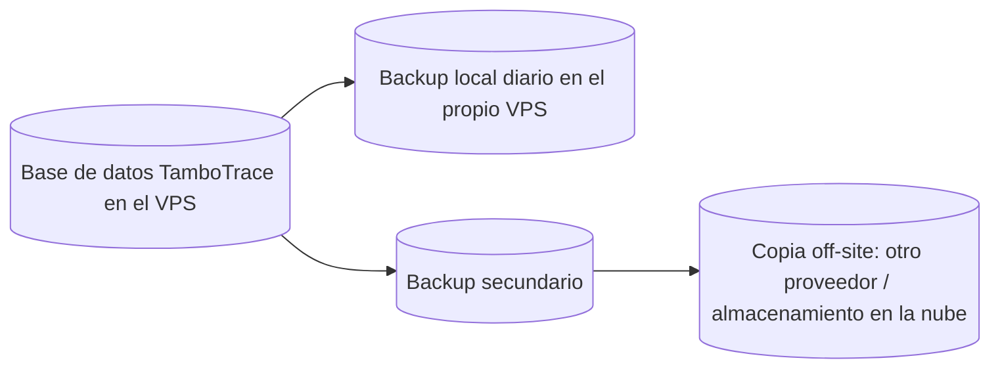

[← Volver al portal](../)

# Cálculo de requerimientos de hardware y software para desplegar TamboTrace en un VPS

## Objetivo de esta práctica

Tomar un caso ya definido en otra materia — el proyecto Scrum **TamboTrace** (`ing_software-3ro-bt/Practicos/proyecto_scrum_trazabilidad_lechera.md`) — y resolver la pregunta que ese documento deja abierta: **RNF9** dice *"la solución debe poder desplegarse en hosting externo, ya que el cliente no posee servidor propio"*, pero no dice en qué máquina, con qué stack ni con qué política de seguridad y respaldo.

Esta práctica cierra esa brecha: convierte el requerimiento funcional/no funcional en un **VPS con Ubuntu Server + Docker + Docker Compose + UFW + backups 3-2-1**, dimensionado con la misma calculadora usada en el resto del curso (`Teoricos/calculadora_requerimientos_servidor.html`) y con cada número justificado a partir del documento original.

> **No se inventa un caso nuevo.** Cada dato de entrada de este cálculo se referencia contra un RF, un RNF o una sección puntual del documento de TamboTrace. Donde el documento no da un número exacto, se declara explícitamente el supuesto y el criterio usado para completarlo.

---

## Paso 0 — Releer el caso con ojos de administrador de sistemas

El documento original fue escrito para un Product Owner/Scrum Team, no para quien va a dimensionar el servidor. Antes de calcular nada hay que releerlo buscando **implicancias técnicas**, no funcionales:

| Dato del caso original | Referencia | Implicancia técnica |
|---|---|---|
| Establecimiento mediano, 280 vacas | §1 | Volumen de datos bajo: no es una aplicación de "big data". |
| Usuarios: administración, encargado de tambo, 2 operarios, veterinario | §5, tabla §6 | Entre 4 y 5 usuarios nombrados; la concurrencia real (usuarios usando el sistema *al mismo tiempo*) es menor todavía. |
| "No dependa de una sola persona" | §2, necesidad inicial | Justifica backups y un servidor accesible remotamente, no una PC de escritorio. |
| Internet estable en oficina, Wi-Fi irregular en sala de ordeñe (RNF12) | §5, RNF1, RNF12 | La app debe ser liviana; no cambia el dimensionamiento del servidor, pero sí el perfil de carga (no es "carga intensiva"). |
| RNF9: hosting externo, sin servidor propio | §12 | Confirma que corresponde un **VPS**, no un servidor físico en el tambo. |
| RNF6: respaldos automáticos diarios | §12 | Define la política de backup a implementar (Parte 5 de esta práctica). |
| RNF10: debe poder crecer sin rediseñar la base de datos | §12 | Justifica proyectar el crecimiento de datos a 12 meses, no dimensionar solo para el día 1. |
| RNF3: respuesta en menos de 3 segundos bajo carga normal | §12 | Confirma perfil **"Pequeña producción"**, no "Laboratorio" (que no garantiza rendimiento). |
| Presupuesto total del proyecto: USD 5.000–7.000 (§ Parte 6) | §17, §18 | El hosting es un costo operativo mensual, no parte del costo de desarrollo — debe ser una fracción pequeña de ese presupuesto para no comprometerlo. |
| Alcance excluido: RFID, offline completo, IA, integración externa (§10) | §10 | Confirma que no hay cargas pesadas de cómputo (sin IA, sin procesamiento de sensores) que compliquen el dimensionamiento. |

Esta tabla es el puente entre el documento de Ingeniería de Software y esta práctica de Administración de Sistemas: **todo lo que sigue son números derivados de esta lectura**, no una arquitectura elegida al azar.

---

## Paso 1 — Traducir la arquitectura de TamboTrace a contenedores

A partir de las épicas EP1–EP8 y los RF1–RF15, TamboTrace es una aplicación web típica de 3 capas. La forma más simple y estándar de desplegarla con Docker Compose es:

| Contenedor | Rol | Relación con el caso original |
|---|---|---|
| `tambotrace-app` | Aplicación web (backend + frontend) | Resuelve RF1–RF15: login, vacas, ordeñes, lotes, reportes. |
| `tambotrace-db` | Base de datos relacional (PostgreSQL) | Persiste vacas, ordeñes, lotes y su historial (RF15, RNF7). Relacional porque hay relaciones fuertes vaca↔ordeñe↔lote (RNF10 pide crecer sin rediseñar). |
| `reverse-proxy` (nginx) | Punto de entrada HTTP/HTTPS único | RNF1: acceso desde PC, tablet o celular vía navegador. Centraliza TLS. |
| `adminer` (administración de BD) | Herramienta de administración de la base de datos | Apoya RNF7/RF15 (auditoría) al permitir inspeccionar datos sin acceso directo por SSH. |

Esto da los parámetros de "carga de trabajo" que pide la calculadora:

- **Aplicaciones web** = **1** (`tambotrace-app`)
- **Bases de datos** = **1** (`tambotrace-db`)
- **Contenedores auxiliares** = **2** (`reverse-proxy` + `adminer`)

> Los backups (Parte 5) se ejecutan con `cron` **en el host**, no en un contenedor aparte — se mantiene igual criterio que en `plan_servidor_linux_docker.md` (sección 24), así que no suman a "contenedores auxiliares".

---

## Paso 2 — Estimar los usuarios concurrentes

El documento nombra usuarios **nombrados**, no usuarios **concurrentes**, que es lo que pide la calculadora. Hay que interpretar:

- En oficina: administración (1).
- En sala de ordeñe: encargado + 2 operarios (3), normalmente durante los turnos de ordeñe (mañana/tarde).
- Veterinario: acceso esporádico, no simultáneo con el resto (1).

Sumando los roles nombrados en §5/§6: **5 usuarios nombrados**. Como la calculadora pide *concurrencia real* (todos usando el sistema en el mismo instante), y en un tambo mediano es poco probable que los 5 coincidan exactamente al mismo segundo, se toma el total de usuarios nombrados **más un margen para picos** (por ejemplo, dos operarios cargando datos a la vez durante el ordeñe, mientras administración exporta un reporte):

```text
usuarios_concurrentes = usuarios_nombrados (5) + margen de pico (1) = 6
```

**Usuarios concurrentes estimados = 6.**

---

## Paso 3 — Elegir el perfil de carga

La calculadora ofrece 4 perfiles. Se descarta "Laboratorio/aprendizaje" (RNF3 exige tiempos de respuesta reales) y se descarta "Carga intensiva" (no hay IA, RFID ni sensores según §10, y el volumen de datos es bajo). Corresponde:

**Perfil = "Pequeña producción" → factor 1.0**

---

## Paso 4 — Aplicar las fórmulas de CPU y RAM (igual que la calculadora)

Se usan **las mismas fórmulas** de `calculadora_requerimientos_servidor.html`, para que el resultado de esta práctica pueda verificarse cargando estos mismos valores en esa página.

Datos de entrada ya definidos:

| Variable | Valor | Origen |
|---|---:|---|
| `usuarios` | 6 | Paso 2 |
| `webapps` | 1 | Paso 1 |
| `dbs` | 1 | Paso 1 |
| `extras` | 2 | Paso 1 |
| `perfil` | 1.0 | Paso 3 |
| Cockpit | Sí (+0.25 GB RAM) | Se habilita para administración remota del VPS, práctica estándar del curso. |
| Margen 25% (SO/picos) | Sí | RNF8 (disponibilidad durante horarios de ordeñe) justifica no dimensionar "al límite". |

### CPU

```text
cpu = (1 + webapps×0.7 + dbs×0.8 + extras×0.18 + usuarios/35) × perfil
cpu = (1 + 1×0.7 + 1×0.8 + 2×0.18 + 6/35) × 1.0
cpu = (1 + 0.70 + 0.80 + 0.36 + 0.171) × 1.0
cpu = 3.031

Con margen del 25%:
cpu = 3.031 × 1.25 = 3.79 vCPU
```

```text
cpuMin = máx(2, techo(3.79))  = 4 vCPU
cpuRec = máx(2, redondear_a_múltiplo(4, 2)) = 4 vCPU
```

### RAM

```text
ram = (1.5 + webapps×0.65 + dbs×1.25 + extras×0.18 + usuarios×0.035 + cockpit(0.25)) × perfil
ram = (1.5 + 0.65 + 1.25 + 0.36 + 0.21 + 0.25) × 1.0
ram = 4.22 GB

Con margen del 25%:
ram = 4.22 × 1.25 = 5.28 GB
```

```text
ramMin = máx(4, techo(5.28)) = 6 GB
ramRec = máx(4, redondear_a_múltiplo(6, 4)) = 8 GB
```

**Resultado parcial: 4 vCPU / 8 GB RAM.**

---

## Paso 5 — Estimar disco: datos actuales, crecimiento (RNF10) y logs

### Datos actuales

TamboTrace todavía no tiene datos reales (es un sistema nuevo, §7 "no necesitamos algo enorme al principio"). Se estima el tamaño inicial de la base de datos con un cálculo simple:

- 280 vacas × ~2 KB de ficha (RF3) ≈ 0,5 MB
- ~2 ordeñes/día × 365 días × ~5 KB de registro (RF5–RF9) ≈ 3,6 MB/año
- Reportes exportados en PDF (RF14), adjuntos y logs de auditoría (RF15/RNF7): margen adicional

Estos volúmenes son minúsculos comparados con el espacio que ya reserva la calculadora para imágenes Docker y logs. Se redondea, con margen amplio para no subestimar:

**Datos actuales = 1 GB**

### Crecimiento proyectado (RNF10)

RNF10 exige que el sistema "permita crecer en cantidad de animales y lotes sin rediseñar la base de datos". Esto es una decisión de **modelo de datos**, pero también implica dimensionar el disco pensando en 12 meses de uso, no solo en el día del despliegue:

- Crecimiento mensual estimado: **10%** (valor de referencia de la calculadora; razonable para un sistema que recién arranca y va sumando lotes/ordeñes todos los días).
- Horizonte de dimensionamiento: **12 meses**.

```text
datos_futuros = datos_actuales × (1 + crecimiento)^meses
datos_futuros = 1 GB × (1.10)^12
datos_futuros = 1 GB × 3.138
datos_futuros ≈ 3.14 GB
```

### Imágenes Docker y logs

```text
imagenes_y_logs = 12 + webapps×3 + dbs×2 + extras×1.2
imagenes_y_logs = 12 + 1×3 + 1×2 + 2×1.2
imagenes_y_logs = 12 + 3 + 2 + 2.4 = 19.4 GB
```

(Este número es fijo por diseño de la calculadora: cubre la imagen base de Ubuntu, capas de Docker, imágenes de cada contenedor y una previsión de logs de sistema — ver `plan_servidor_linux_docker.md`, sección 4.)

### Backups locales (adelanto del Paso 6)

```text
backup_local = datos_futuros × retención_días × backups_por_día × 0.65
backup_local = 3.14 × 7 × 1 × 0.65
backup_local ≈ 14.28 GB
```

(0,65 aproxima la compresión típica de un dump SQL comprimido — ver sección 20 de `plan_servidor_linux_docker.md`.)

### Disco total

```text
disco = datos_futuros + imagenes_y_logs + backup_local
disco = 3.14 + 19.4 + 14.28 = 36.82 GB

Con margen del 25%:
disco = 36.82 × 1.25 = 46.02 GB
```

```text
diskMin = máx(40, techo(46.02)) = 47 GB
diskRec = redondear_a_múltiplo(47, 50) = 50 GB
```

No se estima RAID (un VPS ya delega la redundancia física de disco al proveedor de hosting, coherente con RNF9: "no posee servidor propio").

**Resultado parcial: 50 GB SSD.**

---

## Paso 6 — Resultado final del dimensionamiento

| Recurso | Resultado del cálculo | Justificación resumida |
|---|---:|---|
| **vCPU** | **4** | 1 app + 1 DB + 2 auxiliares + 6 usuarios concurrentes, perfil pequeña producción, +25% margen (RNF8) |
| **RAM** | **8 GB** | Igual carga + Cockpit habilitado + margen |
| **Disco** | **50 GB SSD** | 1 GB de datos iniciales proyectado a 12 meses (RNF10) + imágenes/logs + 7 días de backup local (RNF6) + margen |
| **Red** | 1 IP pública, puertos 80/443 abiertos | RNF1 (acceso vía navegador desde cualquier dispositivo) |

> Podés verificar este resultado abriendo `Teoricos/calculadora_requerimientos_servidor.html` y cargando: usuarios=6, apps=1, DBs=1, extras=2, perfil="Pequeña producción", datos=1 GB, crecimiento=10%, meses=12, retención=7, backups=1, con Cockpit y margen del 25% activados.

### Elección de plan de VPS

Con ese resultado, cualquier proveedor de VPS estándar (Hetzner, DigitalOcean, Vultr, OVH, etc.) ofrece un plan equivalente a **4 vCPU / 8 GB RAM / ~80–160 GB SSD** (el disco casi nunca se vende en tramos de exactamente 50 GB, así que se toma el escalón comercial inmediatamente superior) por un costo aproximado de **USD 10–20 por mes**, según el proveedor y la región.

Esto representa entre el **0,15% y el 0,3% mensual** del presupuesto total del proyecto (USD 5.000–7.000, §17), un costo operativo perfectamente razonable que no compromete el presupuesto de desarrollo.

---

## Paso 7 — Software base: Ubuntu Server + Docker + Docker Compose

Siguiendo la misma secuencia que `plan_servidor_linux_docker.md` (secciones 5 a 8):

1. **Ubuntu Server LTS** (última versión LTS disponible al momento del despliegue), instalación mínima, sin entorno gráfico.
2. Actualización del sistema (`apt update && apt upgrade`) y configuración de IP/hostname del VPS.
3. Instalación de **Docker Engine** y el plugin **Docker Compose** desde el repositorio oficial de Docker (no desde el repositorio de Ubuntu, que suele tener versiones desactualizadas).
4. Un único usuario administrador sin contraseña root habilitada por SSH (acceso solo por clave pública), agregado al grupo `docker`.

### `docker-compose.yml` de referencia para TamboTrace

```yaml
services:
  reverse-proxy:
    image: nginx:alpine
    ports:
      - "80:80"
      - "443:443"
    volumes:
      - ./nginx/conf.d:/etc/nginx/conf.d:ro
      - ./nginx/certs:/etc/nginx/certs:ro
    depends_on:
      - app
    restart: unless-stopped

  app:
    build: ./app
    environment:
      - DB_HOST=db
      - DB_NAME=tambotrace
      - DB_USER=tambotrace
      - DB_PASSWORD_FILE=/run/secrets/db_password
    secrets:
      - db_password
    depends_on:
      - db
    restart: unless-stopped

  db:
    image: postgres:16
    environment:
      - POSTGRES_DB=tambotrace
      - POSTGRES_USER=tambotrace
      - POSTGRES_PASSWORD_FILE=/run/secrets/db_password
    secrets:
      - db_password
    volumes:
      - tambotrace_db_data:/var/lib/postgresql/data
    restart: unless-stopped

  adminer:
    image: adminer
    restart: unless-stopped
    # Publicado únicamente en localhost; se accede por túnel SSH, nunca expuesto en UFW.
    ports:
      - "127.0.0.1:8080:8080"

secrets:
  db_password:
    file: ./secrets/db_password.txt

volumes:
  tambotrace_db_data:
```

Esta estructura corresponde exactamente a los 4 contenedores del Paso 1 y respeta la práctica de secretos vista en `plan_servidor_linux_docker.md` (sección 17): la contraseña de la base de datos no queda en variables de entorno planas ni en el repositorio.

---

## Paso 8 — Firewall con UFW

Aplicando la misma política de `plan_servidor_linux_docker.md` (sección 7), adaptada a lo que TamboTrace realmente necesita exponer:

```bash
sudo ufw default deny incoming
sudo ufw default allow outgoing

# Administración remota (antes de activar el firewall)
sudo ufw allow OpenSSH

# RNF1: acceso web desde navegador (PC, tablet, celular)
sudo ufw allow 80/tcp
sudo ufw allow 443/tcp

sudo ufw enable
sudo ufw status verbose
```

Reglas explícitas para este caso:

| Puerto | Servicio | ¿Se abre al público? | Justificación |
|---|---|---|---|
| 22 | SSH | Sí, restringido por clave pública (idealmente además por IP si el proveedor lo permite) | Administración del VPS. |
| 80 / 443 | `reverse-proxy` (nginx) | Sí | RNF1: acceso vía navegador. |
| 5432 | PostgreSQL (`db`) | **No** | El contenedor `db` no publica el puerto al host; solo es alcanzable dentro de la red interna de Docker Compose por `app`. Coherente con la sección 7.2 del curso: *"no exponer bases de datos innecesariamente"*. |
| 8080 | Adminer | **No** (solo `127.0.0.1`) | Administración de la base de datos únicamente vía túnel SSH (`ssh -L 8080:localhost:8080 usuario@vps`), nunca expuesto a Internet — coherente con RNF5 (protección de datos sensibles) y con que el veterinario no debe ver información económica ni administrativa. |

---

## Paso 9 — Backups 3-2-1 (RNF6)

RNF6 exige respaldos automáticos diarios. Se implementa la regla **3-2-1** enseñada en `plan_servidor_linux_docker.md` (sección 19):



- **3 copias**: la base de datos en producción + backup local + copia off-site.
- **2 medios distintos**: disco del VPS + almacenamiento externo (otro proveedor de nube, o un segundo VPS/NAS fuera del mismo datacenter).
- **1 copia fuera del sitio**: nunca en el mismo proveedor/datacenter que el VPS principal, para no perder ambas copias ante una falla del proveedor.

### Qué se respalda

Siguiendo la sección 19.2 del curso ("no alcanza con copiar el contenedor"):

- Dump de PostgreSQL (`pg_dump`), no una copia cruda del contenedor.
- El volumen `tambotrace_db_data` como respaldo adicional.
- Los archivos `docker-compose.yml`, `Dockerfile` de `app`, y la configuración de `nginx`.
- El archivo de secretos (`secrets/db_password.txt`), resguardado de forma independiente y no versionado en git.

### Política concreta para TamboTrace

| Parámetro | Valor elegido | Relación con el caso |
|---|---|---|
| Frecuencia | 1 backup completo por día | RNF6: "respaldos automáticos diarios". |
| Horario | Fuera del horario de ordeñe (madrugada) | RNF2/RNF12: no interferir con la carga de datos en el campo. |
| Retención local | 7 días | Alcanza para restaurar ante un error detectado en la semana, sin ocupar disco de más (ver cálculo de 14,28 GB del Paso 5). |
| Copia off-site | Semanal como mínimo (idealmente diaria) | Regla 3-2-1; protege ante falla total del VPS. |
| Mecanismo | `cron` en el host + script de `pg_dump` comprimido (sección 20 del curso) | Reutiliza exactamente el script ya enseñado en el curso. |
| Prueba de restauración | Al menos 1 vez por mes | Sección 25 del curso: *"prueba obligatoria de restauración"* — un backup nunca probado no es un backup confiable. |

---

## Resumen ejecutivo

| Concepto | Resultado |
|---|---|
| Aplicación | TamboTrace (proyecto Scrum de referencia) |
| Hosting | 1 VPS (Ubuntu Server LTS) — resuelve RNF9 |
| Dimensionamiento | 4 vCPU / 8 GB RAM / 50 GB SSD (plan comercial ≈ 4 vCPU / 8 GB / 80–160 GB) |
| Costo estimado de hosting | USD 10–20/mes (≈0,2% del presupuesto del proyecto) |
| Contenedores | `app`, `db` (PostgreSQL), `reverse-proxy` (nginx), `adminer` |
| Seguridad perimetral | UFW: solo 22 (SSH), 80 y 443 abiertos; DB y Adminer nunca expuestos |
| Backups | 3-2-1, diario, retención local 7 días + copia off-site, con prueba mensual de restauración |

Este resultado queda disponible para usarse tal cual en el **Proyecto Final** de la materia, o como base para repetir el mismo ejercicio con otra aplicación de referencia: la secuencia de 9 pasos (relevar → contenedores → usuarios → perfil → CPU/RAM → disco → elegir VPS → software base → firewall → backups) es reutilizable con cualquier proyecto de Ingeniería de Software que tenga sus RF/RNF documentados.
