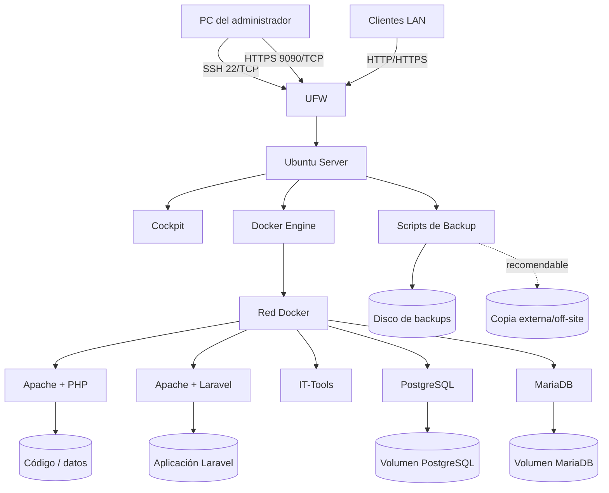
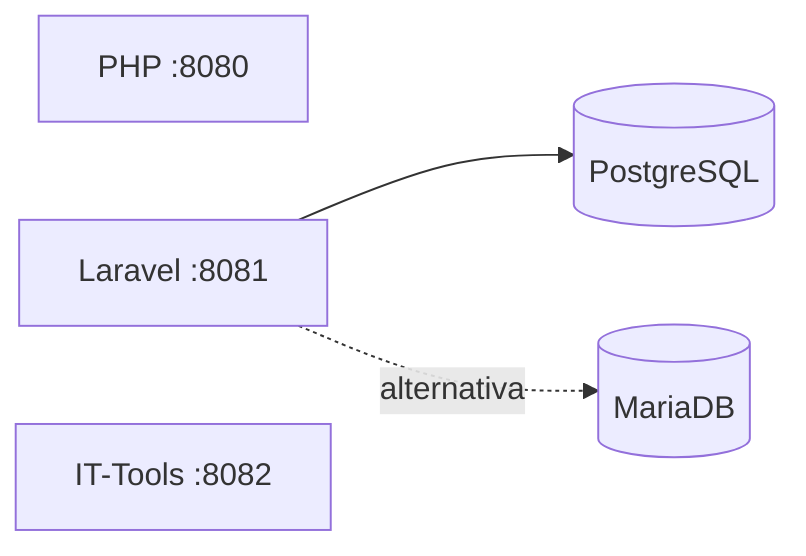
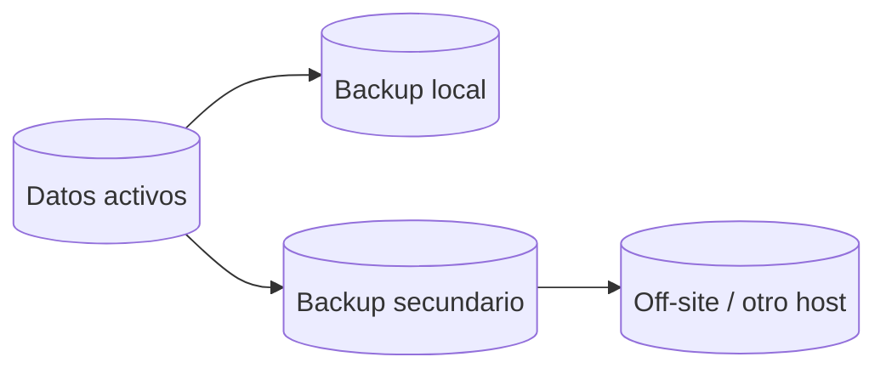
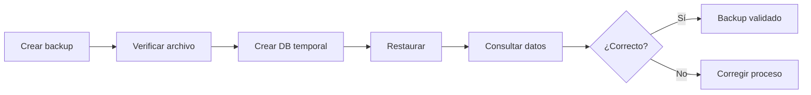

[← Volver al portal](../)

# Laboratorio integral: Servidor Linux con Docker para 3º EMT

> **Plataforma de referencia:** Ubuntu Server LTS  
> **Objetivo:** instalar, asegurar, dimensionar, administrar y respaldar un servidor Linux que ejecute servicios mediante Docker y Docker Compose.  
> **Servicios principales:** Apache + PHP, Apache + Laravel, PostgreSQL, MariaDB e IT-Tools.  
> **Administración web:** Cockpit.  
> **Automatización:** shell scripts para backups y mantenimiento básico.

---

<!-- TOC START -->
## Índice

> Usa los vínculos para desplazarte rápidamente a cada sección.

  - [1. Resultados esperados](#1-resultados-esperados)
- [2. Arquitectura general](#2-arquitectura-general)
- [3. Secuencia de trabajo sugerida](#3-secuencia-de-trabajo-sugerida)
- [4. Calculadora interactiva de hardware](#4-calculadora-interactiva-de-hardware)
  - [4.1 Reglas iniciales de referencia](#41-reglas-iniciales-de-referencia)
- [5. Instalación inicial de Ubuntu Server](#5-instalación-inicial-de-ubuntu-server)
  - [5.1 Configuración recomendada](#51-configuración-recomendada)
  - [5.2 Actualizar el sistema](#52-actualizar-el-sistema)
- [6. Configuración de IP estática con Netplan](#6-configuración-de-ip-estática-con-netplan)
  - [Error crítico a evitar](#error-crítico-a-evitar)
- [7. Configuración básica de UFW](#7-configuración-básica-de-ufw)
  - [7.1 Política inicial](#71-política-inicial)
  - [7.2 No exponer bases de datos innecesariamente](#72-no-exponer-bases-de-datos-innecesariamente)
- [8. Instalación de Docker Engine y Docker Compose](#8-instalación-de-docker-engine-y-docker-compose)
  - [8.1 Eliminar paquetes conflictivos si existieran](#81-eliminar-paquetes-conflictivos-si-existieran)
  - [8.2 Agregar repositorio oficial](#82-agregar-repositorio-oficial)
  - [8.3 Permitir Docker sin sudo](#83-permitir-docker-sin-sudo)
- [9. Conceptos Docker que deben dominarse](#9-conceptos-docker-que-deben-dominarse)
- [10. Comandos esenciales de Docker](#10-comandos-esenciales-de-docker)
- [11. Servicio 1 — Apache + PHP](#11-servicio-1-apache-php)
  - [11.1 Proyecto](#111-proyecto)
  - [11.2 Con docker run](#112-con-docker-run)
  - [11.3 Con Docker Compose](#113-con-docker-compose)
- [12. Servicio 2 — Apache + Laravel](#12-servicio-2-apache-laravel)
  - [12.1 Estructura](#121-estructura)
  - [12.2 Dockerfile](#122-dockerfile)
  - [12.3 Crear Laravel](#123-crear-laravel)
  - [12.4 Con docker run](#124-con-docker-run)
  - [12.5 Con Docker Compose](#125-con-docker-compose)
  - [12.6 Laravel + PostgreSQL](#126-laravel-postgresql)
- [13. Servicio 3 — PostgreSQL](#13-servicio-3-postgresql)
  - [13.1 Volumen](#131-volumen)
  - [13.2 Con docker run](#132-con-docker-run)
  - [13.3 Con Docker Compose](#133-con-docker-compose)
  - [13.4 Acceder con psql](#134-acceder-con-psql)
- [14. Servicio 4 — MariaDB](#14-servicio-4-mariadb)
  - [14.1 Crear volumen](#141-crear-volumen)
  - [14.2 Con docker run](#142-con-docker-run)
  - [14.3 Con Docker Compose](#143-con-docker-compose)
  - [14.4 Acceder al servidor](#144-acceder-al-servidor)
- [15. Servicio 5 — IT-Tools](#15-servicio-5-it-tools)
  - [15.1 Con docker run](#151-con-docker-run)
  - [15.2 Con Docker Compose](#152-con-docker-compose)
- [16. Stack integrado de práctica](#16-stack-integrado-de-práctica)
- [17. Variables y secretos](#17-variables-y-secretos)
- [18. Instalación y configuración de Cockpit](#18-instalación-y-configuración-de-cockpit)
  - [18.1 Instalar](#181-instalar)
  - [18.2 Habilitar](#182-habilitar)
  - [18.3 Firewall](#183-firewall)
  - [18.4 Acceder](#184-acceder)
  - [18.5 Funciones a explorar](#185-funciones-a-explorar)
  - [18.6 Actividad de diagnóstico con Cockpit](#186-actividad-de-diagnóstico-con-cockpit)
- [19. Backups: estrategia](#19-backups-estrategia)
  - [19.1 Regla 3-2-1](#191-regla-3-2-1)
  - [19.2 No es suficiente copiar el contenedor](#192-no-es-suficiente-copiar-el-contenedor)
- [20. Backup PostgreSQL](#20-backup-postgresql)
  - [Restauración](#restauración)
- [21. Backup MariaDB](#21-backup-mariadb)
- [22. Backup genérico de un volumen Docker](#22-backup-genérico-de-un-volumen-docker)
- [23. Script general de backup del proyecto](#23-script-general-de-backup-del-proyecto)
- [24. Programar backups](#24-programar-backups)
  - [Con cron](#con-cron)
  - [Verificar](#verificar)
- [25. Prueba obligatoria de restauración](#25-prueba-obligatoria-de-restauración)
- [26. Monitoreo y diagnóstico](#26-monitoreo-y-diagnóstico)
  - [Host](#host)
  - [Procesos](#procesos)
  - [Docker](#docker)
  - [systemd](#systemd)
  - [Espacio Docker](#espacio-docker)
- [27. Recetario: 20 contenedores útiles](#27-recetario-20-contenedores-útiles)
  - [Categoría A — Diagnóstico y administración de red](#categoría-a-diagnóstico-y-administración-de-red)
  - [Categoría B — Administración Docker](#categoría-b-administración-docker)
  - [Categoría C — Desarrollo web y APIs](#categoría-c-desarrollo-web-y-apis)
  - [Categoría D — Bases de datos y administración](#categoría-d-bases-de-datos-y-administración)
  - [Categoría E — Gestión y colaboración](#categoría-e-gestión-y-colaboración)
- [28. Tabla resumen del recetario](#28-tabla-resumen-del-recetario)
- [29. Proyecto integrador propuesto](#29-proyecto-integrador-propuesto)
  - [Escenario](#escenario)
  - [Entregables](#entregables)
- [30. Pruebas de aceptación](#30-pruebas-de-aceptación)
  - [Red](#red)
  - [Firewall](#firewall)
  - [Docker](#docker)
  - [HTTP](#http)
  - [PostgreSQL](#postgresql)
  - [MariaDB](#mariadb)
  - [Cockpit](#cockpit)
  - [Backups](#backups)
  - [Restauración](#restauración)
- [31. Fallas deliberadas para diagnóstico](#31-fallas-deliberadas-para-diagnóstico)
- [32. Buenas prácticas que deben quedar incorporadas](#32-buenas-prácticas-que-deben-quedar-incorporadas)
- [33. Referencias técnicas](#33-referencias-técnicas)
- [34. Hoja rápida de puertos del laboratorio](#34-hoja-rápida-de-puertos-del-laboratorio)
- [35. Comando de inspección final](#35-comando-de-inspección-final)

<!-- TOC END -->

## 1. Resultados esperados

Al finalizar el recorrido deberías poder:

1. Dimensionar CPU, RAM y almacenamiento para un servidor pequeño.
2. Instalar Ubuntu Server y realizar la configuración inicial.
3. Asignar una IP estática mediante Netplan.
4. Configurar un firewall básico con UFW.
5. Instalar Docker Engine y Docker Compose v2.
6. Entender imágenes, contenedores, volúmenes, redes y puertos.
7. Ejecutar aplicaciones con `docker run`.
8. Traducir esos comandos a archivos `compose.yaml`.
9. Construir una imagen propia para una aplicación Laravel.
10. Ejecutar PostgreSQL y MariaDB con persistencia.
11. Instalar y administrar Cockpit.
12. Crear backups con shell scripts y programarlos.
13. Restaurar datos desde un backup.
14. Supervisar uso de CPU, RAM, disco, logs y contenedores.
15. Documentar la infraestructura desplegada.

---

# 2. Arquitectura general



---

# 3. Secuencia de trabajo sugerida

```mermaid
flowchart LR
    A[Dimensionar] --> B[Instalar Ubuntu]
    B --> C[Actualizar SO]
    C --> D[IP estática]
    D --> E[UFW + SSH]
    E --> F[Docker]
    F --> G[Docker Compose]
    G --> H[Servicios]
    H --> I[Cockpit]
    I --> J[Backups]
    J --> K[Restauración]
    K --> L[Monitoreo]
    L --> M[Documentación]
```



---

# 4. Calculadora interactiva de hardware

Se incluye junto a este documento:

**`calculadora_requerimientos_servidor.html`**

Abrir el archivo directamente en Firefox, Chrome, Edge o Safari.

La calculadora utiliza:

- usuarios concurrentes;
- cantidad de aplicaciones PHP/Laravel;
- cantidad de bases de datos;
- contenedores auxiliares;
- perfil de carga;
- datos almacenados;
- crecimiento mensual;
- período de dimensionamiento;
- retención de backups;
- margen operativo;
- opción RAID1.

### Qué enseña la calculadora

No intenta sustituir un benchmark real. Su función es enseñar el concepto de **capacity planning**:

```text
Demanda de aplicación
        +
Demanda de base de datos
        +
Concurrencia
        +
Sistema operativo
        +
Crecimiento
        +
Backups
        +
Margen de seguridad
        =
Requerimiento estimado
```

## 4.1 Reglas iniciales de referencia

| Escenario | CPU | RAM | Disco |
|---|---:|---:|---:|
| Laboratorio mínimo | 2 vCPU | 4 GB | 40–60 GB SSD |
| Laboratorio cómodo | 4 vCPU | 8 GB | 80–120 GB SSD |
| Servidor pequeño | 4 vCPU | 8–16 GB | 120–250 GB SSD |
| Varias apps + DB | 6–8 vCPU | 16 GB | 250+ GB SSD/NVMe |

Estas cifras son **puntos de partida**, no garantías.

### Recursos que suelen transformarse en cuellos de botella

- PHP/Laravel: CPU y RAM.
- PostgreSQL/MariaDB: RAM, IOPS y latencia de disco.
- Logs: almacenamiento.
- Backups: almacenamiento y rendimiento de disco.
- Muchos usuarios concurrentes: CPU, RAM, DB y red.

---

# 5. Instalación inicial de Ubuntu Server

## 5.1 Configuración recomendada

Durante la instalación:

- Ubuntu Server LTS.
- OpenSSH Server habilitado.
- usuario administrativo no llamado `root`;
- contraseña robusta;
- hostname descriptivo, por ejemplo:

```text
srv-docker-01
```

## 5.2 Actualizar el sistema

```bash
sudo apt update
sudo apt full-upgrade -y
sudo reboot
```

Verificar:

```bash
hostnamectl
ip address
ip route
df -h
free -h
```

Instalar utilidades:

```bash
sudo apt install -y \
  curl wget git vim nano htop btop ncdu tree \
  unzip zip jq ca-certificates gnupg ufw
```

---

# 6. Configuración de IP estática con Netplan

> Antes de editar la red, identificar la interfaz.

```bash
ip link
ip address
ip route
```

Ejemplo:

- interfaz: `ens18`
- IP: `192.168.10.50/24`
- gateway: `192.168.10.1`
- DNS: `1.1.1.1`, `8.8.8.8`

Archivo típico:

```bash
sudo nano /etc/netplan/01-static.yaml
```

Contenido:

```yaml
network:
  version: 2
  ethernets:
    ens18:
      dhcp4: false
      addresses:
        - 192.168.10.50/24
      routes:
        - to: default
          via: 192.168.10.1
      nameservers:
        addresses:
          - 1.1.1.1
          - 8.8.8.8
```

Validar:

```bash
sudo netplan try
```

Aplicar:

```bash
sudo netplan apply
```

Verificar:

```bash
ip addr show ens18
ip route
ping -c 4 192.168.10.1
ping -c 4 1.1.1.1
ping -c 4 google.com
```

## Error crítico a evitar

No ejecutar `netplan apply` remotamente sin comprobar la configuración. Una IP, gateway o interfaz incorrecta puede cortar la conexión SSH.

---

# 7. Configuración básica de UFW

## 7.1 Política inicial

```bash
sudo ufw default deny incoming
sudo ufw default allow outgoing
```

Permitir SSH **antes de activar el firewall**:

```bash
sudo ufw allow OpenSSH
```

O:

```bash
sudo ufw allow 22/tcp
```

Permitir HTTP/HTTPS:

```bash
sudo ufw allow 80/tcp
sudo ufw allow 443/tcp
```

Cockpit:

```bash
sudo ufw allow 9090/tcp
```

Para una LAN concreta es mejor:

```bash
sudo ufw allow from 192.168.10.0/24 to any port 9090 proto tcp
```

Activar:

```bash
sudo ufw enable
```

Verificar:

```bash
sudo ufw status verbose
sudo ufw status numbered
```

## 7.2 No exponer bases de datos innecesariamente

En producción, PostgreSQL `5432` y MariaDB `3306` deberían permanecer dentro de la red Docker siempre que las aplicaciones sean quienes acceden a ellas.

---

# 8. Instalación de Docker Engine y Docker Compose

## 8.1 Eliminar paquetes conflictivos si existieran

```bash
for pkg in docker.io docker-doc docker-compose podman-docker containerd runc; do
  sudo apt-get remove -y "$pkg"
done
```

## 8.2 Agregar repositorio oficial

```bash
sudo apt update
sudo apt install -y ca-certificates curl
sudo install -m 0755 -d /etc/apt/keyrings

sudo curl -fsSL https://download.docker.com/linux/ubuntu/gpg \
  -o /etc/apt/keyrings/docker.asc

sudo chmod a+r /etc/apt/keyrings/docker.asc
```

```bash
sudo tee /etc/apt/sources.list.d/docker.sources >/dev/null <<EOF
Types: deb
URIs: https://download.docker.com/linux/ubuntu
Suites: $(. /etc/os-release && echo "${UBUNTU_CODENAME:-$VERSION_CODENAME}")
Components: stable
Architectures: $(dpkg --print-architecture)
Signed-By: /etc/apt/keyrings/docker.asc
EOF
```

Instalar:

```bash
sudo apt update

sudo apt install -y \
  docker-ce \
  docker-ce-cli \
  containerd.io \
  docker-buildx-plugin \
  docker-compose-plugin
```

Comprobar:

```bash
sudo systemctl status docker
sudo docker run --rm hello-world
docker compose version
```

## 8.3 Permitir Docker sin sudo

```bash
sudo usermod -aG docker "$USER"
```

Cerrar sesión y volver a entrar.

Comprobar:

```bash
docker ps
```

> **Importante:** pertenecer al grupo `docker` equivale prácticamente a disponer de privilegios administrativos sobre el host. No debe otorgarse indiscriminadamente.

---

# 9. Conceptos Docker que deben dominarse

| Concepto | Explicación |
|---|---|
| Image | Plantilla inmutable utilizada para crear contenedores. |
| Container | Instancia en ejecución de una imagen. |
| Volume | Almacenamiento persistente administrado por Docker. |
| Bind mount | Carpeta del host montada dentro del contenedor. |
| Port mapping | Relación `puerto_host:puerto_contenedor`. |
| Network | Red virtual para comunicación entre contenedores. |
| Environment variable | Configuración entregada al proceso del contenedor. |
| Dockerfile | Receta para construir una imagen. |
| Compose | Declaración YAML de uno o varios servicios. |
| Registry | Repositorio de imágenes, por ejemplo Docker Hub o GHCR. |

---

# 10. Comandos esenciales de Docker

```bash
docker version
docker info

docker images
docker ps
docker ps -a

docker pull nginx
docker run nginx

docker logs CONTENEDOR
docker logs -f CONTENEDOR

docker exec -it CONTENEDOR bash

docker stop CONTENEDOR
docker start CONTENEDOR
docker restart CONTENEDOR

docker rm CONTENEDOR
docker rmi IMAGEN

docker volume ls
docker network ls

docker stats
docker system df
```

Compose:

```bash
docker compose up
docker compose up -d
docker compose ps
docker compose logs
docker compose logs -f
docker compose pull
docker compose restart
docker compose down
```

---

# 11. Servicio 1 — Apache + PHP

La imagen oficial `php:<versión>-apache` ya combina Apache HTTP Server con PHP.

## 11.1 Proyecto

```bash
mkdir -p ~/docker/php-apache/src
cd ~/docker/php-apache
```

Crear:

```bash
nano src/index.php
```

```php
<?php
echo "<h1>Servidor PHP funcionando</h1>";
phpinfo();
```

## 11.2 Con `docker run`

```bash
docker run -d \
  --name php-apache \
  --restart unless-stopped \
  -p 8080:80 \
  -v "$PWD/src:/var/www/html:ro" \
  php:8.3-apache
```

Probar:

```text
http://IP_SERVIDOR:8080
```

## 11.3 Con Docker Compose

`compose.yaml`:

```yaml
services:
  web:
    image: php:8.3-apache
    container_name: php-apache
    restart: unless-stopped
    ports:
      - "8080:80"
    volumes:
      - ./src:/var/www/html:ro
```

Ejecutar:

```bash
docker compose up -d
```

---

# 12. Servicio 2 — Apache + Laravel

Laravel necesita extensiones PHP y Composer. En lugar de utilizar una imagen genérica sin preparar, se construirá una imagen propia.

## 12.1 Estructura

```text
laravel-app/
├── compose.yaml
├── Dockerfile
└── app/
```

## 12.2 Dockerfile

```dockerfile
FROM php:8.3-apache

RUN apt-get update \
    && apt-get install -y --no-install-recommends \
       git unzip libpq-dev libzip-dev \
    && docker-php-ext-install pdo pdo_mysql pdo_pgsql \
    && a2enmod rewrite \
    && rm -rf /var/lib/apt/lists/*

COPY --from=composer:2 /usr/bin/composer /usr/bin/composer

ENV APACHE_DOCUMENT_ROOT=/var/www/html/public

RUN sed -ri \
    -e 's!/var/www/html!${APACHE_DOCUMENT_ROOT}!g' \
    /etc/apache2/sites-available/*.conf \
    /etc/apache2/apache2.conf \
    /etc/apache2/conf-available/*.conf

WORKDIR /var/www/html
```

## 12.3 Crear Laravel

```bash
mkdir -p ~/docker/laravel-app
cd ~/docker/laravel-app
```

Después de crear el `Dockerfile`:

```bash
docker build -t aula-laravel-apache .
```

Crear proyecto usando Composer:

```bash
docker run --rm \
  -v "$PWD:/workspace" \
  -w /workspace \
  composer:2 \
  composer create-project laravel/laravel app
```

## 12.4 Con `docker run`

```bash
docker build -t aula-laravel-apache .
```

```bash
docker run -d \
  --name laravel-web \
  --restart unless-stopped \
  -p 8081:80 \
  -v "$PWD/app:/var/www/html" \
  aula-laravel-apache
```

Permisos de desarrollo:

```bash
docker exec laravel-web \
  chown -R www-data:www-data storage bootstrap/cache
```

## 12.5 Con Docker Compose

```yaml
services:
  laravel:
    build:
      context: .
    container_name: laravel-web
    restart: unless-stopped
    ports:
      - "8081:80"
    volumes:
      - ./app:/var/www/html
```

```bash
docker compose up -d --build
```

## 12.6 Laravel + PostgreSQL

```yaml
services:
  laravel:
    build: .
    restart: unless-stopped
    ports:
      - "8081:80"
    volumes:
      - ./app:/var/www/html
    environment:
      DB_CONNECTION: pgsql
      DB_HOST: db
      DB_PORT: 5432
      DB_DATABASE: laravel
      DB_USERNAME: laravel
      DB_PASSWORD: change_me
    depends_on:
      - db

  db:
    image: postgres:17
    restart: unless-stopped
    environment:
      POSTGRES_DB: laravel
      POSTGRES_USER: laravel
      POSTGRES_PASSWORD: change_me
    volumes:
      - postgres_data:/var/lib/postgresql/data

volumes:
  postgres_data:
```

Aquí `DB_HOST=db` funciona porque Compose proporciona DNS interno utilizando el nombre del servicio.

---

# 13. Servicio 3 — PostgreSQL

## 13.1 Volumen

```bash
docker volume create postgres_data
```

## 13.2 Con `docker run`

```bash
docker run -d \
  --name postgres \
  --restart unless-stopped \
  -e POSTGRES_DB=appdb \
  -e POSTGRES_USER=appuser \
  -e POSTGRES_PASSWORD='Cambiar-Esta-Clave' \
  -v postgres_data:/var/lib/postgresql/data \
  postgres:17
```

No se publica `5432` porque se asume acceso sólo desde otros contenedores.

Si fuera necesario en el laboratorio:

```bash
-p 5432:5432
```

## 13.3 Con Docker Compose

```yaml
services:
  postgres:
    image: postgres:17
    restart: unless-stopped
    environment:
      POSTGRES_DB: appdb
      POSTGRES_USER: appuser
      POSTGRES_PASSWORD: Cambiar-Esta-Clave
    volumes:
      - postgres_data:/var/lib/postgresql/data

volumes:
  postgres_data:
```

## 13.4 Acceder con `psql`

```bash
docker exec -it postgres \
  psql -U appuser -d appdb
```

---

# 14. Servicio 4 — MariaDB

## 14.1 Crear volumen

```bash
docker volume create mariadb_data
```

## 14.2 Con `docker run`

```bash
docker run -d \
  --name mariadb \
  --restart unless-stopped \
  -e MARIADB_ROOT_PASSWORD='Cambiar-Root' \
  -e MARIADB_DATABASE=appdb \
  -e MARIADB_USER=appuser \
  -e MARIADB_PASSWORD='Cambiar-App' \
  -v mariadb_data:/var/lib/mysql \
  mariadb:lts
```

## 14.3 Con Docker Compose

```yaml
services:
  mariadb:
    image: mariadb:lts
    restart: unless-stopped
    environment:
      MARIADB_ROOT_PASSWORD: Cambiar-Root
      MARIADB_DATABASE: appdb
      MARIADB_USER: appuser
      MARIADB_PASSWORD: Cambiar-App
    volumes:
      - mariadb_data:/var/lib/mysql

volumes:
  mariadb_data:
```

## 14.4 Acceder al servidor

```bash
docker exec -it mariadb \
  mariadb -u root -p
```

---

# 15. Servicio 5 — IT-Tools

IT-Tools agrupa utilidades para developers y administradores: codificación, conversión, redes, JWT, hashes, UUID, timestamps y otras.

## 15.1 Con `docker run`

```bash
docker run -d \
  --name it-tools \
  --restart unless-stopped \
  -p 8082:80 \
  corentinth/it-tools:latest
```

## 15.2 Con Docker Compose

```yaml
services:
  it-tools:
    image: corentinth/it-tools:latest
    container_name: it-tools
    restart: unless-stopped
    ports:
      - "8082:80"
```

---

# 16. Stack integrado de práctica



Ejemplo `compose.yaml` general:

```yaml
services:
  php:
    image: php:8.3-apache
    restart: unless-stopped
    ports:
      - "8080:80"
    volumes:
      - ./php:/var/www/html:ro

  laravel:
    build: ./laravel
    restart: unless-stopped
    ports:
      - "8081:80"
    volumes:
      - ./laravel/app:/var/www/html
    environment:
      DB_CONNECTION: pgsql
      DB_HOST: postgres
      DB_PORT: 5432
      DB_DATABASE: laravel
      DB_USERNAME: laravel
      DB_PASSWORD: change_me
    depends_on:
      - postgres

  postgres:
    image: postgres:17
    restart: unless-stopped
    environment:
      POSTGRES_DB: laravel
      POSTGRES_USER: laravel
      POSTGRES_PASSWORD: change_me
    volumes:
      - postgres_data:/var/lib/postgresql/data

  mariadb:
    image: mariadb:lts
    restart: unless-stopped
    environment:
      MARIADB_ROOT_PASSWORD: change_root
      MARIADB_DATABASE: appdb
      MARIADB_USER: appuser
      MARIADB_PASSWORD: change_app
    volumes:
      - mariadb_data:/var/lib/mysql

  it-tools:
    image: corentinth/it-tools:latest
    restart: unless-stopped
    ports:
      - "8082:80"

volumes:
  postgres_data:
  mariadb_data:
```

---

# 17. Variables y secretos

En clase se pueden mostrar variables directamente en Compose para entender su funcionamiento.

Luego debe migrarse a `.env`.

`.env`:

```dotenv
POSTGRES_DB=laravel
POSTGRES_USER=laravel
POSTGRES_PASSWORD=una-clave-larga
```

`compose.yaml`:

```yaml
services:
  postgres:
    image: postgres:17
    env_file:
      - .env
```

Evitar subir `.env` a Git:

```gitignore
.env
*.sql
backups/
```

---

# 18. Instalación y configuración de Cockpit

Cockpit es una interfaz web para administrar Linux: recursos, almacenamiento, red, servicios systemd, logs, actualizaciones y terminal.

## 18.1 Instalar

```bash
sudo apt update
. /etc/os-release
sudo apt install -y -t "${VERSION_CODENAME}-backports" cockpit
```

Si la versión utilizada no dispone del paquete en backports:

```bash
sudo apt install -y cockpit
```

## 18.2 Habilitar

```bash
sudo systemctl enable --now cockpit.socket
```

Verificar:

```bash
systemctl status cockpit.socket
ss -lntp | grep 9090
```

## 18.3 Firewall

Sólo LAN:

```bash
sudo ufw allow from 192.168.10.0/24 to any port 9090 proto tcp
```

## 18.4 Acceder

```text
https://IP_SERVIDOR:9090
```

El navegador puede advertir sobre un certificado autofirmado.

## 18.5 Funciones a explorar

- Overview.
- CPU y memoria.
- Logs.
- Storage.
- Networking.
- Accounts.
- Services.
- Software Updates.
- Terminal.

## 18.6 Actividad de diagnóstico con Cockpit

1. Abrir **Overview**.
2. Ejecutar:

```bash
docker stats
```

3. Generar carga.
4. Observar CPU/RAM en Cockpit.
5. Reiniciar un contenedor.
6. Localizar el evento en los logs.
7. Revisar el servicio Docker mediante systemd.
8. Comprobar uso de almacenamiento.

### Cockpit no sustituye a Docker Compose

Cockpit administra el host. Para este laboratorio, Docker continuará administrándose principalmente mediante CLI y archivos Compose para que la infraestructura sea reproducible.

---

# 19. Backups: estrategia

## 19.1 Regla 3-2-1

Mantener:

- **3** copias de los datos;
- en al menos **2** medios diferentes;
- **1** copia fuera del servidor.



## 19.2 No es suficiente copiar el contenedor

El contenedor debe poder destruirse y recrearse.

Lo importante es respaldar:

- bases de datos;
- volúmenes;
- bind mounts;
- archivos Compose;
- Dockerfiles;
- `.env` de manera segura;
- scripts;
- certificados/configuraciones necesarias.

---

# 20. Backup PostgreSQL

Crear:

```bash
sudo mkdir -p /srv/backups/postgres
sudo chown "$USER":"$USER" /srv/backups/postgres
```

Script `backup-postgres.sh`:

```bash
#!/usr/bin/env bash
set -Eeuo pipefail

CONTAINER="postgres"
DB="appdb"
USER="appuser"
DEST="/srv/backups/postgres"
KEEP_DAYS=7
STAMP="$(date +'%Y-%m-%d_%H-%M-%S')"
FILE="${DEST}/${DB}_${STAMP}.sql.gz"

mkdir -p "$DEST"

docker exec "$CONTAINER" \
  pg_dump -U "$USER" "$DB" \
  | gzip > "$FILE"

find "$DEST" -type f -name '*.sql.gz' -mtime +"$KEEP_DAYS" -delete

echo "Backup creado: $FILE"
```

Permisos:

```bash
chmod +x backup-postgres.sh
```

Ejecutar:

```bash
./backup-postgres.sh
```

## Restauración

```bash
gunzip -c backup.sql.gz | \
docker exec -i postgres \
psql -U appuser -d appdb
```

---

# 21. Backup MariaDB

`backup-mariadb.sh`:

```bash
#!/usr/bin/env bash
set -Eeuo pipefail

CONTAINER="mariadb"
DB="appdb"
USER="root"
PASSWORD="${MARIADB_BACKUP_PASSWORD:?Definir MARIADB_BACKUP_PASSWORD}"
DEST="/srv/backups/mariadb"
KEEP_DAYS=7
STAMP="$(date +'%Y-%m-%d_%H-%M-%S')"
FILE="${DEST}/${DB}_${STAMP}.sql.gz"

mkdir -p "$DEST"

docker exec \
  -e MYSQL_PWD="$PASSWORD" \
  "$CONTAINER" \
  mariadb-dump -u "$USER" \
  --single-transaction \
  --routines \
  --events \
  "$DB" \
  | gzip > "$FILE"

find "$DEST" -type f -name '*.sql.gz' -mtime +"$KEEP_DAYS" -delete

echo "Backup creado: $FILE"
```

Ejecutar:

```bash
export MARIADB_BACKUP_PASSWORD='clave-root'
./backup-mariadb.sh
unset MARIADB_BACKUP_PASSWORD
```

Restaurar:

```bash
export MARIADB_BACKUP_PASSWORD='clave-root'

gunzip -c backup.sql.gz | \
docker exec -i \
  -e MYSQL_PWD="$MARIADB_BACKUP_PASSWORD" \
  mariadb \
  mariadb -u root appdb
```

---

# 22. Backup genérico de un volumen Docker

Ejemplo:

```bash
docker run --rm \
  -v mariadb_data:/source:ro \
  -v /srv/backups/volumes:/backup \
  alpine \
  tar -czf /backup/mariadb_data.tar.gz -C /source .
```

Restauración:

```bash
docker run --rm \
  -v mariadb_data:/target \
  -v /srv/backups/volumes:/backup:ro \
  alpine \
  sh -c 'cd /target && tar -xzf /backup/mariadb_data.tar.gz'
```

> Para bases de datos, un dump lógico (`pg_dump`, `mariadb-dump`) suele ser más portable y seguro que copiar archivos de datos mientras el DBMS está escribiendo.

---

# 23. Script general de backup del proyecto

```bash
#!/usr/bin/env bash
set -Eeuo pipefail

SOURCE="/srv/docker"
DEST="/srv/backups/config"
RETENTION=14
STAMP="$(date +'%Y-%m-%d_%H-%M-%S')"

mkdir -p "$DEST"

tar \
  --exclude='*/vendor/*' \
  --exclude='*/node_modules/*' \
  -czf "$DEST/docker-config_${STAMP}.tar.gz" \
  "$SOURCE"

find "$DEST" \
  -type f \
  -name 'docker-config_*.tar.gz' \
  -mtime +"$RETENTION" \
  -delete
```

---

# 24. Programar backups

## Con cron

Editar:

```bash
crontab -e
```

Todos los días a las 02:00:

```cron
0 2 * * * /home/admin/scripts/backup-postgres.sh >> /var/log/backup-postgres.log 2>&1
```

MariaDB a las 02:20:

```cron
20 2 * * * /home/admin/scripts/backup-mariadb.sh >> /var/log/backup-mariadb.log 2>&1
```

## Verificar

```bash
crontab -l
tail -f /var/log/backup-postgres.log
```

---

# 25. Prueba obligatoria de restauración

Un backup que nunca fue restaurado es sólo una **suposición de backup**.

Procedimiento:



Ejemplo:

1. Crear backup.
2. Calcular hash:

```bash
sha256sum backup.sql.gz
```

3. Crear una base temporal.
4. Restaurar.
5. Ejecutar consultas.
6. Registrar resultado.
7. Sólo entonces considerar probado el procedimiento.

---

# 26. Monitoreo y diagnóstico

## Host

```bash
uptime
free -h
df -h
df -i
lsblk
ip -br address
ss -tulpn
```

## Procesos

```bash
top
htop
btop
```

## Docker

```bash
docker ps
docker stats
docker system df
docker compose ps
docker compose logs --tail=100
```

## systemd

```bash
systemctl status docker
journalctl -u docker
journalctl -u docker --since today
```

## Espacio Docker

```bash
docker system df
```

Limpiar objetos no utilizados:

```bash
docker image prune
docker container prune
```

Evitar usar indiscriminadamente:

```bash
docker system prune -a --volumes
```

porque puede eliminar datos u objetos que luego hagan falta.

---

# 27. Recetario: 20 contenedores útiles

> Los ejemplos son intencionalmente compactos. Antes de producción deben revisarse versiones, autenticación, TLS, volúmenes, backups y políticas de acceso.

---

## Categoría A — Diagnóstico y administración de red

### 1. IT-Tools

**Uso:** colección web de herramientas técnicas.

```bash
docker run -d --name it-tools --restart unless-stopped \
  -p 8082:80 corentinth/it-tools:latest
```

```yaml
services:
  it-tools:
    image: corentinth/it-tools:latest
    restart: unless-stopped
    ports:
      - "8082:80"
```

### 2. Netshoot

**Uso:** troubleshooting con `dig`, `curl`, `tcpdump`, `ip`, `ss`, etc.

```bash
docker run --rm -it \
  --network host \
  nicolaka/netshoot
```

```yaml
services:
  netshoot:
    image: nicolaka/netshoot
    network_mode: host
    stdin_open: true
    tty: true
```

### 3. Speedtest Tracker

**Uso:** registrar velocidad de Internet.

```bash
docker run -d \
  --name speedtest-tracker \
  --restart unless-stopped \
  -p 8083:80 \
  -e PUID=1000 \
  -e PGID=1000 \
  -v speedtest_config:/config \
  lscr.io/linuxserver/speedtest-tracker:latest
```

```yaml
services:
  speedtest:
    image: lscr.io/linuxserver/speedtest-tracker:latest
    restart: unless-stopped
    ports:
      - "8083:80"
    environment:
      PUID: 1000
      PGID: 1000
    volumes:
      - speedtest_config:/config

volumes:
  speedtest_config:
```

### 4. Uptime Kuma

**Uso:** monitoreo de disponibilidad.

```bash
docker run -d \
  --name uptime-kuma \
  --restart unless-stopped \
  -p 3001:3001 \
  -v uptime-kuma:/app/data \
  louislam/uptime-kuma:1
```

```yaml
services:
  uptime-kuma:
    image: louislam/uptime-kuma:1
    restart: unless-stopped
    ports:
      - "3001:3001"
    volumes:
      - uptime-kuma:/app/data

volumes:
  uptime-kuma:
```

### 5. Smokeping

**Uso:** latencia, pérdida de paquetes y tendencias.

```bash
docker run -d \
  --name smokeping \
  --restart unless-stopped \
  -p 8084:80 \
  -e PUID=1000 -e PGID=1000 \
  -v smokeping_config:/config \
  -v smokeping_data:/data \
  lscr.io/linuxserver/smokeping:latest
```

```yaml
services:
  smokeping:
    image: lscr.io/linuxserver/smokeping:latest
    restart: unless-stopped
    ports:
      - "8084:80"
    environment:
      PUID: 1000
      PGID: 1000
    volumes:
      - smokeping_config:/config
      - smokeping_data:/data

volumes:
  smokeping_config:
  smokeping_data:
```

---

## Categoría B — Administración Docker

### 6. Portainer CE

**Uso:** GUI para Docker.

```bash
docker volume create portainer_data

docker run -d \
  --name portainer \
  --restart always \
  -p 9443:9443 \
  -v /var/run/docker.sock:/var/run/docker.sock \
  -v portainer_data:/data \
  portainer/portainer-ce:lts
```

```yaml
services:
  portainer:
    image: portainer/portainer-ce:lts
    restart: always
    ports:
      - "9443:9443"
    volumes:
      - /var/run/docker.sock:/var/run/docker.sock
      - portainer_data:/data

volumes:
  portainer_data:
```

### 7. Dozzle

**Uso:** visor web de logs Docker.

```bash
docker run -d \
  --name dozzle \
  --restart unless-stopped \
  -p 8085:8080 \
  -v /var/run/docker.sock:/var/run/docker.sock:ro \
  amir20/dozzle:latest
```

```yaml
services:
  dozzle:
    image: amir20/dozzle:latest
    restart: unless-stopped
    ports:
      - "8085:8080"
    volumes:
      - /var/run/docker.sock:/var/run/docker.sock:ro
```

### 8. Watchtower

**Uso:** estudiar actualización automatizada de imágenes.

```bash
docker run -d \
  --name watchtower \
  --restart unless-stopped \
  -v /var/run/docker.sock:/var/run/docker.sock \
  containrrr/watchtower \
  --cleanup
```

```yaml
services:
  watchtower:
    image: containrrr/watchtower
    restart: unless-stopped
    volumes:
      - /var/run/docker.sock:/var/run/docker.sock
    command: --cleanup
```

> En producción conviene controlar cuidadosamente qué servicios se actualizan automáticamente.

### 9. cAdvisor

**Uso:** métricas de contenedores.

```bash
docker run -d \
  --name cadvisor \
  --restart unless-stopped \
  -p 8086:8080 \
  -v /:/rootfs:ro \
  -v /var/run:/var/run:ro \
  -v /sys:/sys:ro \
  -v /var/lib/docker:/var/lib/docker:ro \
  gcr.io/cadvisor/cadvisor:latest
```

```yaml
services:
  cadvisor:
    image: gcr.io/cadvisor/cadvisor:latest
    restart: unless-stopped
    ports:
      - "8086:8080"
    volumes:
      - /:/rootfs:ro
      - /var/run:/var/run:ro
      - /sys:/sys:ro
      - /var/lib/docker:/var/lib/docker:ro
```

### 10. Registry

**Uso:** registry Docker privado básico.

```bash
docker run -d \
  --name registry \
  --restart unless-stopped \
  -p 5000:5000 \
  -v registry_data:/var/lib/registry \
  registry:2
```

```yaml
services:
  registry:
    image: registry:2
    restart: unless-stopped
    ports:
      - "5000:5000"
    volumes:
      - registry_data:/var/lib/registry

volumes:
  registry_data:
```

---

## Categoría C — Desarrollo web y APIs

### 11. Nginx

```bash
docker run -d \
  --name nginx \
  --restart unless-stopped \
  -p 8087:80 \
  nginx:alpine
```

```yaml
services:
  nginx:
    image: nginx:alpine
    restart: unless-stopped
    ports:
      - "8087:80"
```

### 12. Node.js

**Uso:** entorno descartable de Node.

```bash
docker run --rm -it \
  -v "$PWD:/app" \
  -w /app \
  node:22 \
  bash
```

```yaml
services:
  node:
    image: node:22
    working_dir: /app
    volumes:
      - ./:/app
    stdin_open: true
    tty: true
```

### 13. Python

```bash
docker run --rm -it \
  -v "$PWD:/app" \
  -w /app \
  python:3.13 \
  bash
```

```yaml
services:
  python:
    image: python:3.13
    working_dir: /app
    volumes:
      - ./:/app
    stdin_open: true
    tty: true
```

### 14. Redis

```bash
docker run -d \
  --name redis \
  --restart unless-stopped \
  -v redis_data:/data \
  redis:7-alpine \
  redis-server --appendonly yes
```

```yaml
services:
  redis:
    image: redis:7-alpine
    restart: unless-stopped
    command: redis-server --appendonly yes
    volumes:
      - redis_data:/data

volumes:
  redis_data:
```

### 15. Mailpit

**Uso:** servidor SMTP de prueba con interfaz web.

```bash
docker run -d \
  --name mailpit \
  --restart unless-stopped \
  -p 8025:8025 \
  -p 1025:1025 \
  axllent/mailpit:latest
```

```yaml
services:
  mailpit:
    image: axllent/mailpit:latest
    restart: unless-stopped
    ports:
      - "8025:8025"
      - "1025:1025"
```

---

## Categoría D — Bases de datos y administración

### 16. PostgreSQL

```bash
docker run -d \
  --name postgres-lab \
  -e POSTGRES_PASSWORD=labpass \
  -v pg_lab:/var/lib/postgresql/data \
  postgres:17
```

```yaml
services:
  postgres:
    image: postgres:17
    environment:
      POSTGRES_PASSWORD: labpass
    volumes:
      - pg_lab:/var/lib/postgresql/data

volumes:
  pg_lab:
```

### 17. MariaDB

```bash
docker run -d \
  --name mariadb-lab \
  -e MARIADB_ROOT_PASSWORD=labpass \
  -v mariadb_lab:/var/lib/mysql \
  mariadb:lts
```

```yaml
services:
  mariadb:
    image: mariadb:lts
    environment:
      MARIADB_ROOT_PASSWORD: labpass
    volumes:
      - mariadb_lab:/var/lib/mysql

volumes:
  mariadb_lab:
```

### 18. Adminer

**Uso:** administración web de múltiples DBMS.

```bash
docker run -d \
  --name adminer \
  --restart unless-stopped \
  -p 8088:8080 \
  adminer
```

```yaml
services:
  adminer:
    image: adminer
    restart: unless-stopped
    ports:
      - "8088:8080"
```

### 19. pgAdmin 4

```bash
docker run -d \
  --name pgadmin \
  --restart unless-stopped \
  -p 8089:80 \
  -e PGADMIN_DEFAULT_EMAIL=admin@example.local \
  -e PGADMIN_DEFAULT_PASSWORD=ChangeMe123 \
  -v pgadmin_data:/var/lib/pgadmin \
  dpage/pgadmin4
```

```yaml
services:
  pgadmin:
    image: dpage/pgadmin4
    restart: unless-stopped
    ports:
      - "8089:80"
    environment:
      PGADMIN_DEFAULT_EMAIL: admin@example.local
      PGADMIN_DEFAULT_PASSWORD: ChangeMe123
    volumes:
      - pgadmin_data:/var/lib/pgadmin

volumes:
  pgadmin_data:
```

---

## Categoría E — Gestión y colaboración

### 20. Gitea

**Uso:** servidor Git liviano.

```bash
docker run -d \
  --name gitea \
  --restart unless-stopped \
  -p 3000:3000 \
  -p 2222:22 \
  -v gitea_data:/data \
  gitea/gitea:latest
```

```yaml
services:
  gitea:
    image: gitea/gitea:latest
    restart: unless-stopped
    ports:
      - "3000:3000"
      - "2222:22"
    volumes:
      - gitea_data:/data

volumes:
  gitea_data:
```

---

# 28. Tabla resumen del recetario

| # | Contenedor | Categoría | Uso |
|---:|---|---|---|
| 1 | IT-Tools | Red/utilidades | Herramientas técnicas |
| 2 | Netshoot | Red | Troubleshooting |
| 3 | Speedtest Tracker | Red | Medición WAN |
| 4 | Uptime Kuma | Red | Disponibilidad |
| 5 | Smokeping | Red | Latencia |
| 6 | Portainer | Docker | GUI |
| 7 | Dozzle | Docker | Logs |
| 8 | Watchtower | Docker | Actualizaciones |
| 9 | cAdvisor | Docker | Métricas |
| 10 | Registry | Docker | Registry privado |
| 11 | Nginx | Desarrollo | Web/proxy |
| 12 | Node.js | Desarrollo | Runtime |
| 13 | Python | Desarrollo | Runtime |
| 14 | Redis | Desarrollo | Cache/cola |
| 15 | Mailpit | Desarrollo | SMTP de prueba |
| 16 | PostgreSQL | DB | Base SQL |
| 17 | MariaDB | DB | Base SQL |
| 18 | Adminer | DB | GUI DB |
| 19 | pgAdmin | DB | GUI PostgreSQL |
| 20 | Gitea | Colaboración | Git server |

---

# 29. Proyecto integrador propuesto

## Escenario

Una pequeña organización necesita un servidor interno que alojará:

- sitio PHP;
- aplicación Laravel;
- PostgreSQL;
- MariaDB;
- IT-Tools;
- Cockpit;
- backups automáticos.

## Entregables

### A. Diseño

- diagrama de arquitectura;
- cálculo de CPU/RAM/disco;
- direccionamiento IP;
- puertos;
- política UFW;
- estrategia de backup.

### B. Instalación

- Ubuntu actualizado;
- IP estática;
- usuario administrativo;
- SSH;
- UFW.

### C. Docker

- Docker Engine;
- Compose;
- volúmenes;
- redes;
- cinco servicios principales.

### D. Administración

- Cockpit funcional;
- logs revisados;
- monitoreo de recursos.

### E. Backups

- PostgreSQL;
- MariaDB;
- configuración Docker;
- cron;
- prueba documentada de restauración.

### F. Documentación

```text
proyecto-servidor/
├── README.md
├── docs/
│   ├── arquitectura.md
│   ├── direccionamiento.md
│   ├── seguridad.md
│   └── backups.md
├── compose.yaml
├── .env.example
├── laravel/
│   └── Dockerfile
└── scripts/
    ├── backup-postgres.sh
    ├── backup-mariadb.sh
    └── backup-config.sh
```

---

# 30. Pruebas de aceptación

## Red

```bash
ip -br addr
ip route
ping -c 4 GATEWAY
```

## Firewall

```bash
sudo ufw status verbose
```

## Docker

```bash
docker info
docker compose version
docker ps
```

## HTTP

```bash
curl -I http://localhost:8080
curl -I http://localhost:8081
curl -I http://localhost:8082
```

## PostgreSQL

```bash
docker exec postgres \
  pg_isready -U appuser -d appdb
```

## MariaDB

```bash
docker exec mariadb \
  mariadb-admin ping \
  -u root -p
```

## Cockpit

```bash
systemctl is-active cockpit.socket
ss -lnt | grep 9090
```

## Backups

```bash
find /srv/backups -type f -ls
```

## Restauración

Debe demostrarse restaurando al menos una base de datos en una instancia temporal.

---

# 31. Fallas deliberadas para diagnóstico

Introducir una falla por vez:

1. puerto ocupado;
2. contraseña DB incorrecta;
3. volumen mal montado;
4. YAML mal indentado;
5. contenedor detenido;
6. servicio sin `restart`;
7. falta de espacio;
8. permiso incorrecto;
9. IP equivocada;
10. regla UFW ausente;
11. variable `.env` faltante;
12. Laravel con `DB_HOST=localhost` en vez del nombre del servicio;
13. backup sin permisos;
14. nombre de contenedor incorrecto en el script;
15. DNS incorrecto.

Herramientas:

```bash
docker ps -a
docker logs
docker inspect
docker compose config
docker compose logs
journalctl
ss -tulpn
df -h
free -h
ip route
ufw status
```

---

# 32. Buenas prácticas que deben quedar incorporadas

1. No trabajar permanentemente como `root`.
2. Mantener el SO actualizado.
3. Usar SSH con claves cuando sea posible.
4. Restringir UFW al mínimo necesario.
5. No publicar DBs sin necesidad.
6. Utilizar volúmenes para persistencia.
7. No almacenar secretos en Git.
8. Utilizar `.env.example` sin contraseñas reales.
9. Fijar versiones de imágenes en entornos críticos.
10. Revisar imágenes antes de utilizarlas.
11. Mantener backups fuera del host.
12. Probar restauraciones.
13. Documentar puertos y volúmenes.
14. Revisar `docker logs`.
15. Vigilar disco y memoria.
16. Evitar `latest` cuando se requiera reproducibilidad estricta.
17. Aplicar principio de mínimo privilegio.
18. Tratar `/var/run/docker.sock` como recurso altamente privilegiado.
19. No confundir disponibilidad con backup.
20. Medir antes de aumentar hardware.

---

# 33. Referencias técnicas

- Docker Engine para Ubuntu:  
  https://docs.docker.com/engine/install/ubuntu/

- Docker Compose plugin:  
  https://docs.docker.com/compose/install/linux/

- PHP Official Image:  
  https://hub.docker.com/_/php

- PostgreSQL Official Image:  
  https://hub.docker.com/_/postgres

- MariaDB Official Image:  
  https://hub.docker.com/_/mariadb

- Cockpit Project:  
  https://cockpit-project.org/

- Instalación de Cockpit:  
  https://cockpit-project.org/running

- Ubuntu Server — UFW:  
  https://ubuntu.com/server/docs/security-firewall/

- Ubuntu Server — Networking:  
  https://ubuntu.com/server/docs/configuring-networks/

- IT-Tools:  
  https://github.com/CorentinTh/it-tools

---

# 34. Hoja rápida de puertos del laboratorio

| Servicio | Puerto host sugerido | Puerto contenedor |
|---|---:|---:|
| SSH | 22 | — |
| HTTP | 80 | — |
| HTTPS | 443 | — |
| Cockpit | 9090 | — |
| PHP Apache | 8080 | 80 |
| Laravel Apache | 8081 | 80 |
| IT-Tools | 8082 | 80 |
| PostgreSQL | no publicar | 5432 |
| MariaDB | no publicar | 3306 |
| Uptime Kuma | 3001 | 3001 |
| Portainer | 9443 | 9443 |

---

# 35. Comando de inspección final

Una vez completado el servidor:

```bash
echo '=== HOST ==='
hostnamectl

echo '=== RED ==='
ip -br address
ip route

echo '=== FIREWALL ==='
sudo ufw status verbose

echo '=== RECURSOS ==='
free -h
df -h

echo '=== DOCKER ==='
docker version
docker compose version
docker ps

echo '=== ESPACIO DOCKER ==='
docker system df

echo '=== COCKPIT ==='
systemctl status cockpit.socket --no-pager

echo '=== BACKUPS ==='
find /srv/backups -maxdepth 2 -type f -printf '%TY-%Tm-%Td %TH:%TM %10s %p\n' 2>/dev/null | tail -30
```

El resultado de este comando puede adjuntarse a la documentación final como evidencia técnica del estado del servidor.
